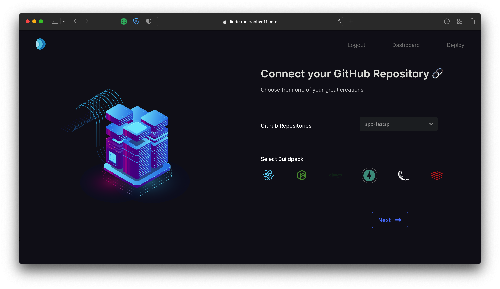

<div id="top"></div>

[![Contributors][contributors-shield]][contributors-url]
[![Forks][forks-shield]][forks-url]
[![Stargazers][stars-shield]][stars-url]
[![Issues][issues-shield]][issues-url]
[![MIT License][license-shield]][license-url]
[![LinkedIn][linkedin-shield]][linkedin-url]


<!-- PROJECT LOGO -->
<br />
<div align="center">
  <a href="https://github.com/radioactive11/diode">
    
  </a>

  <h3 align="center">Diode</h3>

  <p align="center">
    Deployments Made Simple.  
    <br />
    <a href="https://github.com/radioactive11/diode"><strong>Explore the docs »</strong></a>
    <br />
    <br />
    <a href="https://github.com/kg-kartik/moonlight-client/">Frontend</a>
    ·
    <a href="https://github.com/kg-kartik?tab=repositories/">User Backend</a>
    ·
    <a href="https://github.com/radioactive11/diode">View Demo</a>
    ·
    <a href="https://github.com/radioactive11/diode/issues">Report Bug</a>
    ·
    <a href="https://github.com/radioactive11/diode/issues">Request Feature</a>
  </p>
</div>




<!-- TABLE OF CONTENTS -->
<details>
  <summary>Table of Contents</summary>
  <ol>
    <li>
      <a href="#about-the-project">About The Project</a>
      <ul>
        <li><a href="#built-with">Built With</a></li>
      </ul>
    </li>
    <li>
      <a href="#getting-started">Getting Started</a>
      <ul>
        <li><a href="#prerequisites">Prerequisites</a></li>
        <li><a href="#installation">Installation</a></li>
      </ul>
    </li>
    <li><a href="#features">Features</a></li>
    <li><a href="#contributing">Contributing</a></li>
    <li><a href="#license">License</a></li>
    <li><a href="#contact">Contact</a></li>
  </ol>
</details>


<!-- ABOUT THE PROJECT -->
## About The Project


Diode is a platform that lets you deploy your web apps on Linode in two easy steps so that you can spend more time on developing awesome products and less time worrying about getting them up and running 

<p align="right">(<a href="#top">back to top</a>)</p>


### Built With


</p>

<p align="right">(<a href="#top">back to top</a>)</p>


<!-- GETTING STARTED -->
## Getting Started

This is an example of how you can generate your own collaborative recommendation engine.
To get a local copy up and running follow these simple example steps.

### Prerequisites

* Python>=3.7
* Celery
* Redis
* NodeJS
* Next.js
* MongoDB
* Linode Account


### Installation

1. Clone the repo
   ```sh
   git clone https://github.com/radioactive11/diode.git
   ```
2. Create and activate virtual environment
   ```sh
   python3 -m venv venv
   source venv/bin/activate
   ```
3. Install the requirements
   ```sh
   python3 -m pip install -r requirements.txt
   ```
4. Set PYTHONPATH environment variable
   ```sh
   export PYTHONPATH=app
   ```
5. Set `.env` values
```sh
LINODE_PAT= # Linode Personal Access Token
REDIS_URL= # Redis URI
```


<p align="right">(<a href="#top">back to top</a>)</p>


<!-- USAGE EXAMPLES -->
## Features

- Choose region & Linode Plan suited as per your needs 🌍
- Monitor deployment status 🔴 🟡 🟢
- Check live metrics like CPU usage, memory usage of your Linode instance 📈
- Check `output` & `error` logs of your application 📝
- Re-deploy changes ♻️


<p align="right">(<a href="#top">back to top</a>)</p>


<!-- ROADMAP -->

See the [open issues](https://github.com/radioactive11/diode/issues) for a full list of proposed features (and known issues).

<p align="right">(<a href="#top">back to top</a>)</p>


<!-- CONTRIBUTING -->
## Contributing

Contributions are what make the open source community such an amazing place to learn, inspire, and create. Any contributions you make are **greatly appreciated**.

If you have a suggestion that would make this better, please fork the repo and create a pull request. You can also simply open an issue with the tag "enhancement".
Don't forget to give the project a star! Thanks again!

1. Fork the Project
2. Create your Feature Branch (`git checkout -b feature/AmazingFeature`)
3. Commit your Changes (`git commit -m 'Add some AmazingFeature'`)
4. Push to the Branch (`git push origin feature/AmazingFeature`)
5. Open a Pull Request

<p align="right">(<a href="#top">back to top</a>)</p>


<!-- LICENSE -->
## License

Distributed under the MIT License. See `LICENSE.txt` for more information.

<p align="right">(<a href="#top">back to top</a>)</p>


<!-- CONTACT -->
## Contact

- [Arijit Roy](https://github.com/radioactive11/)
- [Kartik Goel](https://github.com/kg-kartik/)
- [Gautam Arora](https://github.com/Gautam-Arora24)
- [Esha Baweja](https://github.com/eshabaweja)

Project Link: [https://github.com/radioactive11/diode](https://github.com/radioactive11/diode)

<p align="right">(<a href="#top">back to top</a>)</p>


<!-- ACKNOWLEDGMENTS -->

<p align="right">(<a href="#top">back to top</a>)</p>


<!-- MARKDOWN LINKS & IMAGES -->
<!-- https://www.markdownguide.org/basic-syntax/#reference-style-links -->
[contributors-shield]: https://img.shields.io/github/contributors/radioactive11/diode.svg?style=for-the-badge
[contributors-url]: https://github.com/radioactive11/diode/graphs/contributors
[forks-shield]: https://img.shields.io/github/forks/radioactive11/diode.svg?style=for-the-badge
[forks-url]: https://github.com/radioactive11/diode/network/members
[stars-shield]: https://img.shields.io/github/stars/radioactive11/diode.svg?style=for-the-badge
[stars-url]: https://github.com/radioactive11/diode/stargazers
[issues-shield]: https://img.shields.io/github/issues/radioactive11/diode.svg?style=for-the-badge
[issues-url]: https://github.com/radioactive11/diode/issues
[license-shield]: https://img.shields.io/github/license/radioactive11/diode.svg?style=for-the-badge
[license-url]: https://github.com/radioactive11/diode/blob/master/LICENSE
[linkedin-shield]: https://img.shields.io/badge/-LinkedIn-black.svg?style=for-the-badge&logo=linkedin&colorB=555
[linkedin-url]: https://linkedin.com/in/arijit--roy
[product-screenshot]: images/screenshot.png